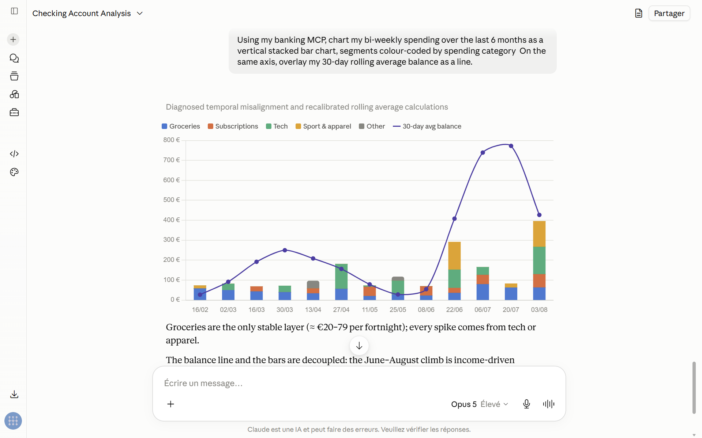
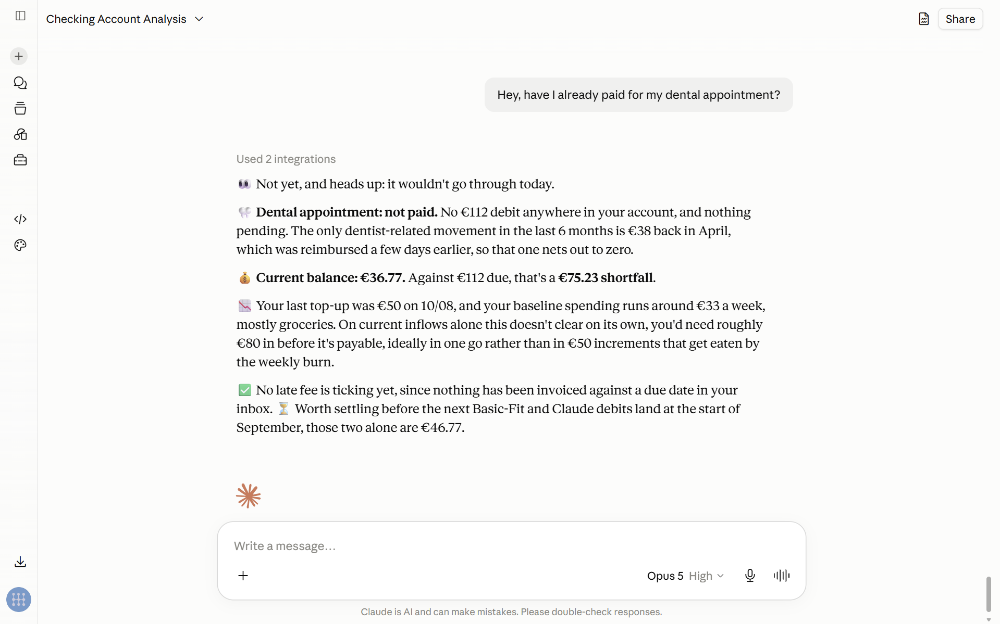

# MCP Bank

A self-hosted [MCP](https://modelcontextprotocol.io) server that gives Claude
read-only access to a real bank account, through
[Enable Banking](https://enablebanking.com) (PSD2 / open banking).

It ships its own OAuth2 authorization server, so it can be added to Claude.ai
as a custom connector without depending on any external identity provider.

## What it looks like

Claude charting six months of spending from the transaction log, with a rolling
average balance overlaid:



And answering a plain question by combining the balance and the transaction log:



## Tools

| Tool | Returns |
|---|---|
| `checking_account_balance` | Closing booked balance, converted to the requested currency |
| `get_transaction_log` | Transactions over a date range: signed amount, running balance, counterparty |

Amounts are converted with ECB rates from [frankfurter.app](https://frankfurter.app).
Supported currencies: EUR, USD, GBP.

## Design

Only **one public URL** is available (a Tailscale hostname), so everything lives
under that single host and routes are told apart by path:

| Route | Role |
|---|---|
| `GET/POST /authorize` | Consent screen and authorization code issuance (RFC 6749 §4.1, PKCE) |
| `POST /oauth/token` | Exchanges a code + PKCE verifier, or client credentials, for a token |
| `GET /.well-known/oauth-authorization-server` | Authorization server metadata (RFC 8414) |
| `GET /.well-known/oauth-protected-resource` | Protected resource metadata (RFC 9728) |
| `ANY /mcp` | The MCP endpoint, behind a Bearer token |

Two grants are supported:

- **Authorization code + PKCE** (RFC 6749 §4.1, RFC 7636) — what Claude.ai uses.
  Anthropic does not accept a pure machine-to-machine grant for connectors:
  every connection requires explicit user consent, even for a single-user setup.
- **Client credentials** (RFC 6749 §4.4) — no browser, no consent screen.
  Convenient for testing with `curl`; Claude.ai never uses it.

With no external identity provider in the picture, this process plays both
roles: it mints the tokens (authorization server) and it verifies them
(resource server). Tokens are HS256 JWTs whose `aud` is the server's own URL,
which is what blocks replaying a token minted for a different server.

## Layout

```
mcp_bank/
├── __main__.py            # entry point: python -m mcp_bank
├── config.py              # every environment variable is read here, once
├── server.py              # FastMCP app, OAuth2 endpoints, discovery metadata
├── tools.py               # the MCP tools and their currency conversion
├── auth/
│   ├── models.py          # plain data structures
│   ├── security.py        # PBKDF2 secret hashing, PKCE S256 verification
│   ├── stores.py          # in-memory registries: clients, authorization codes
│   ├── token_service.py   # JWT issuance and verification
│   └── verifier.py        # adapter to the TokenVerifier protocol of FastMCP
└── banking/
    ├── jwt_auth.py        # RS256 JWTs for the Enable Banking API
    ├── client.py          # balances and transactions for the linked account
    ├── onboarding.py      # one-shot consent flow -> durable session id
    └── data/              # generated session artefacts (git-ignored)
```

## Setup

```bash
python -m venv .venv && source .venv/bin/activate
pip install -r requirements.txt
```

Create a `.env` at the repository root holding both the MCP server keys and the
Enable Banking credentials. It is git-ignored, and `config.py` refuses to start
if any of the required values is missing.

| Variable | Required | What it does |
|---|---|---|
| `SERVER_URL` | | The single public URL the server is exposed under. Used as both the issuer and the audience of the OAuth tokens. Defaults to `http://127.0.0.1:8000`. |
| `HOST`, `PORT` | | Local listen address. Tailscale bridges HTTPS on `SERVER_URL` to this port, so there is no TLS certificate to manage. Default `127.0.0.1:8000`. |
| `JWT_SECRET` | yes | HS256 signing key. Generate a real one with `python -c "import secrets; print(secrets.token_urlsafe(64))"`. |
| `ACCESS_TOKEN_TTL_SECONDS` | | Access token lifetime. Kept short so a leaked token expires fast. Default `3600`. |
| `DEMO_CLIENT_ID`, `DEMO_CLIENT_SECRET` | yes | The OAuth client registered automatically at startup, and what you enter in Claude.ai. |
| `OAUTH_REDIRECT_URI` | | The only `redirect_uri` accepted out of `/authorize`, matched exactly to prevent open redirects. Defaults to the fixed callback of the hosted Claude surfaces. |
| `EB_BASE_URL` | | Enable Banking API root. Default `https://api.enablebanking.com`. |
| `EB_APP_ID` | yes | Application id from the Enable Banking control panel. |
| `PRIVATE_KEY_ENABLE` | yes | Absolute path to the RSA private key downloaded alongside it. Keep it out of the repository. |
| `EB_ASPSP_NAME`, `EB_ASPSP_COUNTRY` | onboarding | The bank to connect to. The name must match the `/aspsps` listing exactly; the onboarding command prints the available names when it does not. |
| `EB_REDIRECT_URL` | onboarding | Where the bank sends you back. Must match the URL registered with Enable Banking; the onboarding command listens on whatever host, port and path it names. |
| `SESSION_ID` | serving | Printed by the onboarding command. Leave it unset on a first run. |

### 1. Link the bank account

Run once to obtain a session that stays valid for months:

```bash
python -m mcp_bank.banking.onboarding
```

It checks the bank name against the Enable Banking listing, prints a consent
URL, serves the callback locally at whatever address `EB_REDIRECT_URL` points
to, and exchanges the returned code for a session. Copy the printed
`SESSION_ID` into `.env`.

### 2. Run the server

```bash
python -m mcp_bank
```

It listens on `127.0.0.1:8000`. In another terminal, expose it:

```bash
tailscale funnel --bg --https=443 8000
```

**`funnel`, not `serve`.** Claude.ai runs in Anthropic's cloud, not on your
machine or your tailnet, so `tailscale serve` would be unreachable to it.
`funnel` puts the server on the public internet — a real change in exposure for
something that reaches bank data, so only enable it once the OAuth flow has been
verified locally.

### 3. Connect it to Claude.ai

Settings → Connectors → Add custom connector:

- **URL**: `https://your-machine.your-tailnet.ts.net/mcp`
- **Client ID**: the value of `DEMO_CLIENT_ID`
- **Client Secret** (optional): the value of `DEMO_CLIENT_SECRET`. Claude accepts
  a public client secured by PKCE alone; supplying the secret additionally
  enables `client_secret_post` verification.

Claude discovers the rest through
`/.well-known/oauth-authorization-server`, then runs the authorization code +
PKCE flow: redirect to `/authorize`, click **Allow**, redirect back to
`https://claude.ai/api/mcp/auth_callback` with a code, exchanged for a token
behind the scenes.

## Testing the auth flow

Request a token with the demo client:

```bash
curl -s -X POST "$SERVER_URL/oauth/token" -d grant_type=client_credentials -d client_id=demo-client -d client_secret=change-me-demo-secret
```

```json
{
  "access_token": "eyJhbGciOi...",
  "token_type": "Bearer",
  "expires_in": 3600,
  "scope": "mcp:invoke"
}
```

Call the MCP endpoint with it:

```bash
curl -s "$SERVER_URL/mcp" -H "Authorization: Bearer $ACCESS_TOKEN" -H "Content-Type: application/json" -H "Accept: application/json, text/event-stream" -d '{"jsonrpc":"2.0","id":1,"method":"initialize","params":{"protocolVersion":"2025-06-18","capabilities":{},"clientInfo":{"name":"curl-test","version":"0.0.1"}}}'
```

Without a token, or with an expired one, FastMCP answers `401 Unauthorized`
before any MCP logic runs.

Check discovery:

```bash
curl -s "$SERVER_URL/.well-known/oauth-authorization-server"
```

## Notes and limitations

- Client and authorization-code registries are **in memory**: they reset on
  restart, and the demo client is re-seeded from `.env`. A production setup
  would back `ClientStore` with a database and add a registration endpoint.
- `OAUTH_REDIRECT_URI` is an exact-match allowlist of one. Without it, an
  attacker-supplied `redirect_uri` could carry the authorization code away.
- Only the **first account** of the Enable Banking session is read.
- Tokens are HS256 because issuer and verifier are the same process. Split them
  and this should become RS256.
- Never commit `.env` or the `.pem` private key; both are git-ignored.
